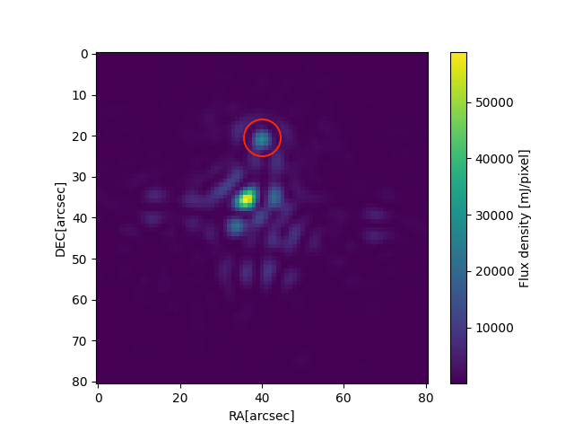

# Simulating Direct Exoplanet Detection with MIRI on the James-Webb Space Telescope

## Context
With the **James-Webb Space Telescope (JWST)**, astronomy has gained the largest and most powerful space telescope in history. This remarkable instrument enables us to explore not only our solar system but the entire universe in unprecedented detail. Particularly, the field of **exoplanetary science** stands to benefit immensely from the capabilities of the JWST, allowing researchers to directly detect exoplanets. To date, only about **0.01%** of exoplanets have been detected directly.

## Aims
The goal of this project was to create a Python code to simulate direct, coronagraphic exoplanet detection using **MIRI** (the Mid-Infrared Instrument) onboard the JWST. As of now, there is no publicly available code to achieve this. The project is structured as follows:
- **Introduction to MIRI** onboard the JWST.
- **Explanation of coronagraphs**, using MIRI’s four coronagraphs as examples.
- **Simulation of direct exoplanet detection**, followed by a discussion of the results.

## Method
I developed a Python script that combines **PanCAKE**, a simulator capable of simulating coronagraphic observations of the MIRI instrument, with **MIRIsim**, the MIRI simulation engine. This combination allows for the simulation of coronagraphic observations with MIRI for a given target scene. The process involves:
1. Creating a coronagraphic observation with PanCAKE.
2. Storing the observation as a file.
3. Providing this file to MIRIsim, which then simulates an imager observation based on the scene.

## Conclusion
In this project, I developed a tool that enables users to simulate coronagraphic observations with the JWST. The generated data are formatted as **Level 1b data**, which can be utilized further along the JWST data processing pipeline.

